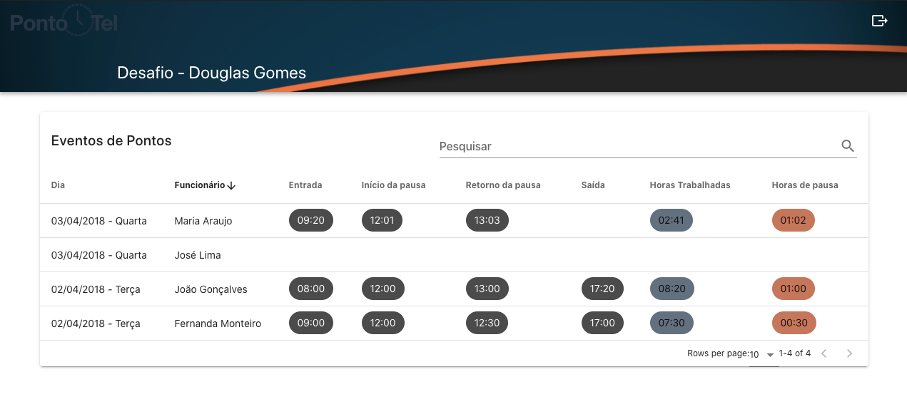

# desafio-pontotell
Repositório utilizado para o desafio da vaga de desenvolvedor na Ponto Tel.




## Project setup
```
yarn install
```

### Compiles and hot-reloads for development
```
yarn serve
```

### Compiles and minifies for production
```
yarn build
```

### Lints and fixes files
```
yarn lint
```

### **Um pouco sobre as ferramentas**

- https://momentjs.com/
- https://github.com/axios/axios
- https://vuetifyjs.com/
- https://vuejs.org/